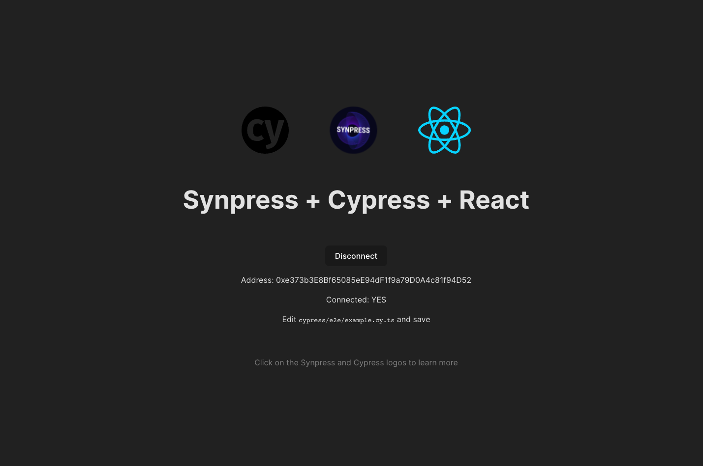

# Synpress GitLab Demo

This repo is a POC example on how to run **Synpress** from GitLab CI/CD pipeline.



## How to run Synpress from GitLab CI/CD?

#### 1. You need to create a docker image from your dApp

Checkout this [Dockerfile](./Dockerfile) example.

```dockerfile
# syntax=docker/dockerfile:1
FROM --platform=linux/amd64 synthetixio/docker-e2e:18.13-ubuntu as base

RUN mkdir /app
WORKDIR /app

COPY package.json ./
COPY yarn.lock ./

FROM base as test
RUN yarn --frozen-lockfile --prefer-offline --no-audit
COPY . .
```

#### 2. Create a docker-compose file

Checkout this [docker-compose.yml](./docker-compose.yml) file here.

Note that [docker-compose.yml](./docker-compose.yml) has the essentials to run
the code from CI/CD. For more comprehensive example check out [synpress/docker-compose.ci.yml](https://github.com/Synthetixio/synpress/blob/dev/docker-compose.ci.yml)

```yml
version: "3.9"

services:
  synpress:
    profiles:
      - synpress
    container_name: synpress
    build: .
    environment:
      - DISPLAY=display:0.0
      - CYPRESS_DOCKER_RUN=true
      - CI=true
    entrypoint: []
    working_dir: /app
    command: >
      yarn test:e2e
    depends_on:
      - display
    networks:
      - x11

  display:
    profiles:
      - synpress
    container_name: display
    image: synthetixio/display:016121eafdfff448414894d0ca5a50b1d72b62eb-base
    environment:
      - RUN_XTERM=no
      - DISPLAY_WIDTH=800
      - DISPLAY_HEIGHT=600
    ports:
      - "8080:8080"
    networks:
      - x11

networks:
  x11:
```

#### 3. Run docker-compose from `.gitlab-ci.yml`

```yml
# .gitlab-ci.yml
build image:
  image: docker
  services:
    - docker:dind
  script:
    - docker-compose -f docker-compose.yml up synpress
```

Having any question? feel free to open an issue on [GitHub](https://github.com/Synthetixio/synpress/issues).

By Ahmed Ibrhaimd [@neuodev](https://github.com/neuodev) — [me@ahmedibrahim.dev](mailto:me@hamedibrahim.dev)
